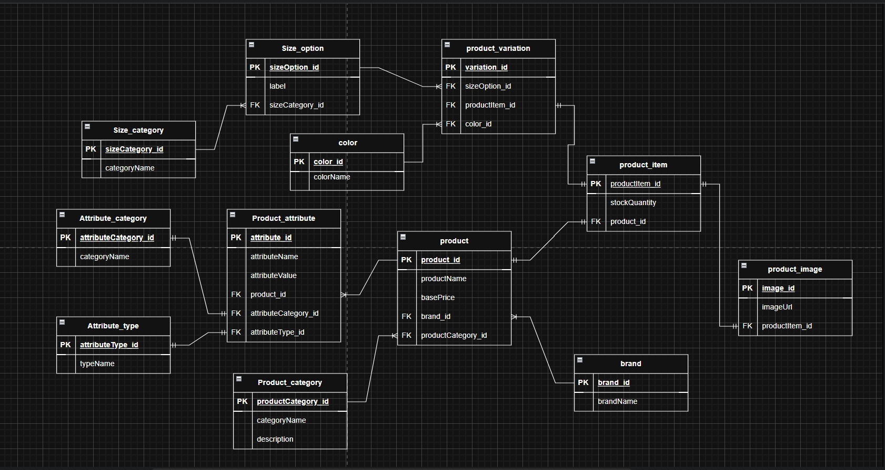

# Ecommerce Database - Group 221

## the following  are the tables for our e-commerce platform 🛍️:

🖼️ product_image – Stores product image URLs or file references

🎨 color – Manages available color options

🗂️ product_category – Classifies products into categories (e.g., clothing, electronics)

📦 product – Stores general product details (name, brand, base price)

🧾 product_item – Represents purchasable items with specific variations

🏷️ brand – Stores brand-related data

🔄 product_variation – Links a product to its variations (e.g., size, color)

📏 size_category – Groups sizes into categories (e.g., clothing sizes, shoe sizes)

📐 size_option – Lists specific sizes (e.g., S, M, L, 42)

🧵 product_attribute – Stores custom attributes (e.g., material, weight)

📚 attribute_category – Groups attributes into categories (e.g., physical, technical)

🧪 attribute_type – Defines types of attributes (e.g., text, number, boolean)

---
### Entity Relationship Diagram
[ERD On Draw.io website](https://app.diagrams.net/#G1_ZwSeelbMa7WzxHri3WKKumqMfIdBN3q#%7B%22pageId%22%3A%22gT5sNrZfBBIdK79uJkW8%22%7D)

